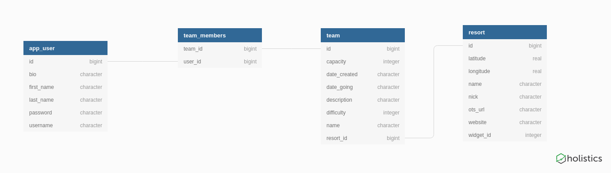

<a id="top"></a>

# peAk

```
Code Fellows; seattle-ja-401d2
Darrin Howell, Nick Crain, Jason Burns
```

### Target Demographic:
Avid snowboarders with robust social lives who want to streamline their mountian plans, together.

### Preliminary Vision:
The app that we plan to develop is called “Ride Together”. This app will make API requests to get weather reports of ski resorts within a specified radius of their phone’s location (NOAA API / Cordova API). In addition to making requests for weather, the app will render the nearby ski resorts (Google Maps API), and show the icons of fellow app users who have checked in to that resort for a trip. After rendering the maps page, users will have the ability to send invites to other friends / groups of friends alerting them (Twilio API) to join them on their snowboarding trip. We will have a database of user checkins as well as group meetups that specify time, people included, and mountain visited. We could also add in a search function that would allow users to check-in / plan trips at mountains all over the world. 

Please comment / edit regarding stretch goal ideas, other APIs to use, and ideas for views / the user’s flow through the application. This is a rough, rough draft. 

### Using peAK:
To use our application, navigate to <a href="https://apex-trio-peak.herokuapp.com/">https://apex-trio-peak.herokuapp.com/</a>. Once at the home page, you can view all mountain conditions at the resorts stored in our database. Click on a resort from the list to view a map of the region surrounding our resort. Our On The Snow widget shows the snow level at the base of the mountain and at the top during the day in which you visit the site. Temperatures are also recorded, and the number of lifts open is also displayed. (To see a full snowfall report and forecast, click the hyperlink on our widget; this will take you to the On The Snow website for that specific resort.) <br/>

Non-registered users can view all teams who plan to visit a mountain. To create a new team and to join a team and connect with other skiers and snowboarders at a specific resort, you need to sign up if you’re a first time user, or log in if you already have a user account. Once you have either created or joined a team at a specific resort, you can view all of your teams and upcoming trips at your profile page.  

### Images:

##### Home Page:  


##### Home Page -- Teams Est.:


##### Team Detail View:


##### Team Creation View:  


##### My Profile -- Teams Recorded: 


### User Stories:

#### App Users:

- As a user, I want to be able to see mountain conditions and groups of people visiting ski resorts so that I can connect with other app users.<br/>

- As a user, I want to have login access to the application so that I can access application features. <br/> 

- As a user, I want to be able to create groups / trips at specific ski resorts to host snowboard meetups for a given time period. <br/>

- As a user, I want to be able to join groups that aren’t full so that I can connect with other snowboarders and skiers.<br/>

- As a user, I want to have a map of all of the resorts in my general vicinity so that I can pick a place that I want to go. <br/> 

- As a user, after creating the group, I want to have the ability to edit group details (potentially remove users from group.)<br/>


#### Developers:

- As a developer, I want the flow of the website to make sense, such that the user experience is enjoyable. <br/>

- As a developer, I want our database and view progression to have parallel structures so that we can streamline organization of both. <br/>

- As a developer, I want to use authorization in my website so that non-registered users don’t have access to the things that they shouldn’t. <br/>

- As a developer, I want an object representing representing each user to exist in the database so that I can access and show user profile data. <br/>

- As a developer, I want the information in the database to be relationally organized so that related data is easy to find. <br/>

- As a developer I want the API calls to Google Maps and NOAA to successfully render a map with  nearby resorts and to return weather data. <br/>

- As a developer, I want to make an API call to Cordova to ascertain my phones GeoCode location to provide Google Maps and NOAA with correct location data. <br/>

#### Stretch Goals:
- As a user, I want to be able to add friends to the app so that I can connect with people whom I’ve met at various meetups. <br/>

- As a dev, I want to give the group creators admin privileges. This will enable them to remove anyone from the group who is abusing the site. <br/>

- As a dev, I want to drop a pin on the Google Maps iFrame to provide a visual representation of which groups are snowboarding on specific passes. 


### Workflow: 

Each of our teammates checked out a new feature branch when building out a new component of our web app. Once we were done with a feature, we pushed our work to a remote development branch for staging. Before merging, we performed a code review with at least one other team member before merging to our development branch. After our development branch was updated according to a specific milestone, we then merged the development branch to master. 

During development, we deployed our website on heroku from our development branch. Upon completion of the first iteration of our project, we then merged everything to master. We then switched the deploy branch from development to master on heroku as well. 

### Testing:
To test this app, follow these instructions:
1. Ensure the auto-create line in application.properties is uncommented, and run the app itself at least once to create the proper database table structure and remove reset all local data.
2. Run the provided resorts.sql and teams_and_users.sql files to create the dummy data needed for testing
3. Run the tests through your prefered IDE, or with `./gradlew test` in your console.

### Database Schema:


### Attributions:
* Various Spring Docs - https://docs.spring.io
* Tutorials from Baeldung - https://www.baeldung.com/
* Answer from the user Kurt Bourbaki to handle issues with sending serialized data as JSON - https://stackoverflow.com/questions/3325387/infinite-recursion-with-jackson-json-and-hibernate-jpa-issue
* Answers for various usages of security with spring and thymeleaf - https://stackoverflow.com/questions/35090329/how-to-display-current-logged-in-users-information-in-all-templates-including-v and https://stackoverflow.com/questions/28904176/thymeleaf-with-spring-security-how-to-check-if-user-is-logged-in-or-not
* Tutorials from Google Maps API Developer Docs - https://developers.google.com/maps/documentation/javascript/tutorial
* Background image from unsplash.com

<!-- [:top: Contents](#contents) -->
